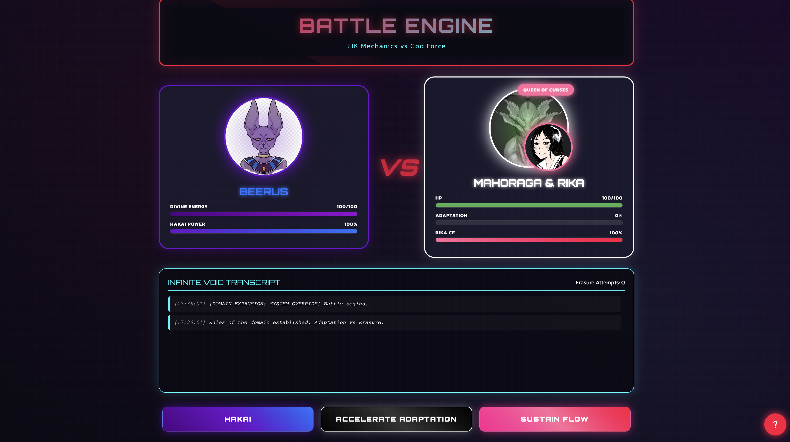

# Mahoraga & Rika vs Lord Beerus: The Ultimate Adaptation

&descAlign=79&fontAlign=50&descAlignY=70&fontColor=f7f5f5)

<p align="center">A cosmic battle simulation where Mahoraga's infinite adaptation faces Beerus's ultimate destruction. Can adaptation overcome erasure itself?</p>

   

## Quick Links

<div align="left">
    <a href="https://github.com/zuck30/Mahorika_VS_Beerus"></a>
    <a href="#demo"></a>
</div>

<br>

- ⚔️ Experience the ultimate crossover battle between Jujutsu Kaisen and Dragon Ball Super
- 🎮 Interactive battle simulation with real-time mechanics
- 🌀 Watch Mahoraga adapt to Hakai in real-time with visual wheel animations
- 💀 Witness Beerus's frustration as his erasure power becomes ineffective

## Tech Stack

**Frontend**


**Runtime & Tools**


## The Premise

Lord Beerus, the God of Destruction, detects a "peculiar anomaly" in the Jujutsu Kaisen universe - an entity capable of adapting to any and all phenomena. Intrigued and threatened, Beerus arrives to erase this anomaly. Meanwhile, Mahoraga, the Eight-Handled Sword Divergent Sila Divine General, is summoned and reinforced by Rika's infinite Cursed Energy. The stage is set for a battle that questions the very concepts of destruction and adaptation.

## Battle Mechanics

### Beerus (God of Destruction)
- **Divine Energy Pool**: Beerus's life force. If depleted or overwhelmed, the battle ends.
- **Hakai (Erasure)**: Beerus's ultimate technique that erases targets from existence. Effectiveness decreases as Mahoraga adapts.
- **Destruction Meter**: Each Hakai attempt accelerates Mahoraga's adaptation through the wheel's rotation.

### Mahoraga & Rika (The Adaptation Duo)
- **Physical Integrity (HP)**: Mahoraga's existence stability. Reaching 0 means complete erasure.
- **Adaptation Progress**: Percentage tracking adaptation to Hakai. At 100%, Mahoraga becomes immune to erasure.
- **Cursed Energy Flow**: Rika channels infinite energy to sustain Mahoraga, healing damage over time.
- **Adaptation Focus**: Mahoraga can prioritize wheel rotation over defense, increasing vulnerability for faster adaptation.

## Quick Start

### Prerequisites
- Node.js (v16 or higher)
- npm or yarn package manager

### Installation & Setup

1. **Clone the Repository**
   ```bash
   git clone https://github.com/zuck30/Mahorika_VS_Beerus.git
   cd Mahorika_VS_Beerus
   ```

2. **Install Dependencies**
   ```bash
   npm install
   # or
   yarn install
   ```

3. **Run the Application**
   ```bash
   npm start
   # or
   yarn start
   ```

4. **Open Your Browser**
   Navigate to `http://localhost:3000` to begin the battle!

### Alternative Setup with Vite
If you prefer Vite for faster development:
```bash
npm run dev
# The application will be available at `http://localhost:5173`
```

## How to Play

1. **Start the Battle**: Click "Begin Battle" to initialize the confrontation
2. **Observe Mechanics**: Watch as Beerus uses Hakai and Mahoraga's wheel turns
3. **Control Adaptation**: Use the control panel to:
   - Sustain Mahoraga with Rika's energy
   - Accelerate adaptation (but become more vulnerable)
   - Monitor adaptation progress and health
4. **Victory Conditions**:
   - Mahoraga wins if adaptation reaches 100%
   - Beerus wins if Mahoraga's HP reaches 0

## Application Screenshots

### Battle Arena

*The main battle interface showing both combatants and their status*

## Features

### Game Mechanics
- **Real-time Adaptation**: Dynamic adaptation based on Hakai usage
- **Strategic Choices**: Balance between healing and adaptation speed
- **Progressive Difficulty**: Hakai effectiveness decreases over time
- **Battle Logging**: Complete history of all battle events

### Responsive Design
Optimized for all devices:
- Mobile (320px+)
- Tablet (768px+)
- Desktop (1024px+)
- Large screens (1200px+)

## Development Notes

### Recent Improvements
- **Fixed Component Errors**: Resolved missing component imports for all battle elements
- **TypeScript Integration**: Full type safety with proper interfaces
- **Asset Management**: Optimized image loading with proper Webpack configuration
- **Code Quality**: Resolved ESLint warnings and improved code structure
- **Performance**: Optimized animations and state management


### Common Issues

**Port Already in Use**
```bash
# Kill process on port 3000
npx kill-port 3000
# Restart the application
npm start
```

**Missing Dependencies**
```bash
# Clear node_modules and reinstall
rm -rf node_modules package-lock.json
npm install
```

**TypeScript Errors**
```bash
# Check TypeScript compilation
npx tsc --noEmit
# Or rebuild types
npm run build
```

## Future Enhancements

### Planned Features
- **Additional Characters**: Sukuna, Gojo, and other DBS gods
- **Multi-phase Battles**: Beerus using more destruction techniques
- **Sound Effects**: Anime-accurate audio for attacks and abilities
- **Save States**: Save and load battle progress
- **Difficulty Levels**: Adjust battle speed and complexity
- **Glitch Animations**: Representing Hakai's reality-breaking effects
- **Wheel Rotation**: Smooth animation showing adaptation progress
- **Energy Particles**: Visualizing cursed energy flow from Rika
- **Destruction Effects**: Hakai's erasure visualization

### Technical Improvements
- **WebGL Integration**: For more complex particle effects
- **WebSocket Support**: Multiplayer battle mode
- **Progressive Web App**: Offline capability and installation
- **Analytics**: Track battle statistics and outcomes

## Contributing

We welcome contributions! Here's how you can help:

1. **Report Bugs**: Open an issue with detailed reproduction steps
2. **Suggest Features**: Share your ideas for new mechanics or characters
3. **Submit Pull Requests**: Follow our coding standards and include tests
4. **Improve Documentation**: Help make this README even better!

### Development Workflow
```bash
# 1. Fork the repository
# 2. Clone your fork
git clone https://github.com/zuck30/Mahorika_VS_Beerus.git

# 3. Create a feature branch
git checkout -b feature/amazing-feature

# 4. Make your changes and commit
git commit -m 'Add amazing feature'

# 5. Push to your fork
git push origin feature/amazing-feature

# 6. Open a Pull Request
```

## License

This project is licensed under the MIT License. See the [LICENSE](LICENSE) file for details.

## Acknowledgments

- **Gege Akutami** for creating Jujutsu Kaisen and Mahoraga
- **Akira Toriyama** for creating Dragon Ball Super and Beerus
- **All Contributors** who have helped improve this project
- **The Anime Community** for endless inspiration

## Support the Project

<p align="center">
    Enjoying the battle? Consider supporting the development!
    <br><br>
    <a href="https://www.buymeacoffee.com/zuck30" target="_blank">
        
    </a>
</p>

## Disclaimer

This project is a fan-made, non-commercial simulation created for entertainment and educational purposes. All characters and concepts belong to their respective copyright holders:
- Jujutsu Kaisen © Gege Akutami / Shueisha
- Dragon Ball Super © Akira Toriyama / Bird Studio / Shueisha / Toei Animation

No copyright infringement intended. This project is not affiliated with, endorsed by, or connected to the official creators or publishers.

<p align="center">
    <b>Will adaptation triumph over destruction? The answer lies in your hands.</b>
    <br>
    <i>Start the battle and witness cosmic power clash!</i>
</p>

<div align="center">
    
    
    
</div>
